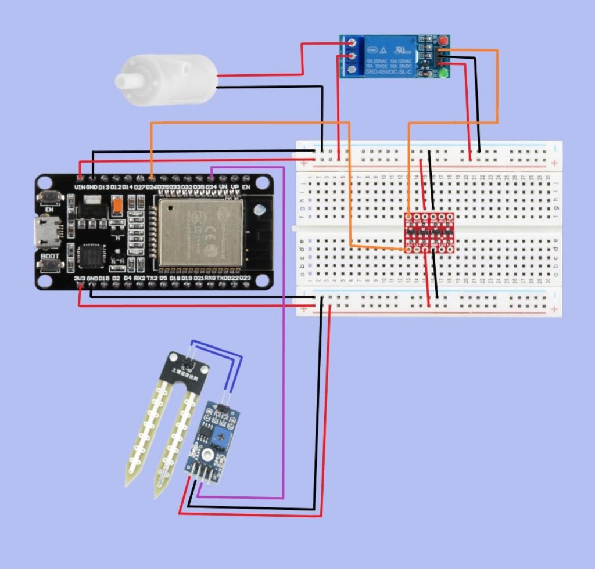
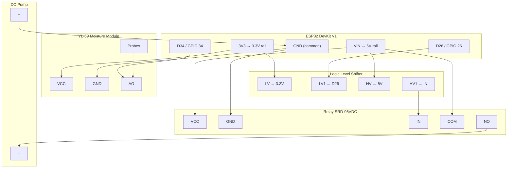

# Wiring Guide — Smart Irrigation System

Wiring matches the **D-CoE IoT Hands-on Kit** bench layout (ESP32 DevKit V1, logic level shifter, relay, YL-69 moisture module, DC pump).

## Bench Wiring Diagram



**Power:** Connect the ESP32 via **USB**. VIN feeds the 5 V breadboard rail (relay, level shifter HV, pump). 3V3 feeds the moisture sensor. Tie both GND rails together.

| Wire colour (typical) | Connection |
|-----------------------|------------|
| Purple | Moisture **AO** → ESP32 **D34** |
| Orange | ESP32 **D26** → level shifter **LV1** → **HV1** → relay **IN** |
| Red | Power rails (+) — sensor VCC, relay VCC, relay COM, pump supply |
| Black | Power rails (−) — common GND |
| Blue | Moisture probe → LM393 module |

## Components

| Part | Role |
|------|------|
| ESP32 DevKit V1 (30-pin) | Wi-Fi, ADC read, relay control signal |
| YL-69 soil moisture module + probes | Analog moisture reading |
| 4-channel logic level shifter | Steps 3.3 V (ESP32) → 5 V (relay IN) |
| 1-channel relay (SRD-05VDC-SL-C) | Switches pump power |
| DC motor pump | Water delivery |
| Medium breadboard | Dual power rails (5 V top, 3.3 V bottom) |

## Pin Map

| ESP32 Pin | Label | Connects To | Notes |
|-----------|-------|-------------|-------|
| **VIN** | — | Breadboard **5 V** rail (+) | Powers relay zone |
| **GND** (near VIN) | — | Breadboard **5 V** rail (−) | Common with 3.3 V GND |
| **3V3** | — | Breadboard **3.3 V** rail (+) | Powers sensor zone |
| **GND** (near 3V3) | — | Breadboard **3.3 V** rail (−) | Tie to 5 V GND |
| **D34 / GPIO 34** | ADC | Moisture module **AO** | Input-only; analog read |
| **D26 / GPIO 26** | OUT | Level shifter **LV1** | 3.3 V control signal |

## Power Rails (Breadboard)

```
TOP RAIL    (+) ← ESP32 VIN (5 V)     — relay, level shifter HV, pump supply
TOP RAIL    (−) ← ESP32 GND

BOTTOM RAIL (+) ← ESP32 3V3           — moisture sensor only
BOTTOM RAIL (−) ← ESP32 GND           — must connect to top GND rail
```

> Use **3.3 V** for the moisture sensor. Do **not** power the sensor from 5 V.

## Soil Moisture Sensor (YL-69 module)

```
  VCC ──► 3.3 V rail
  GND ──► 3.3 V GND rail
  AO  ──► ESP32 D34 (GPIO 34)
  DO  ──► (not used — firmware reads analog AO)
```

Screw the **probe pair** into the module terminals, then insert probes into soil.

## Logic Level Shifter

The relay IN pin expects 5 V logic; ESP32 GPIO outputs 3.3 V. Use the red 4-channel level converter:

| Level shifter | Connect to |
|---------------|------------|
| **LV** | 3.3 V rail |
| **GND** (LV side) | 3.3 V GND rail |
| **LV1** | ESP32 **D26** (GPIO 26) |
| **HV** | 5 V rail |
| **GND** (HV side) | 5 V GND rail |
| **HV1** | Relay **IN** |

## Relay Module + Pump

```
  VCC ──► 5 V rail
  GND ──► 5 V GND rail
  IN  ──► Level shifter HV1

  COM ──► 5 V rail (+)
  NO  ──► Pump (+) red wire
  Pump (−) ──► GND
```

Relay is **active LOW**: `LOW` = pump ON, `HIGH` = pump OFF.

Attach the kit **pipe** to the pump outlet.

## Full System Schematic



## Jumper Wire Checklist

| # | From | To |
|---|------|-----|
| 1 | ESP32 3V3 | Moisture VCC |
| 2 | ESP32 GND | Moisture GND |
| 3 | ESP32 D34 | Moisture AO |
| 4 | ESP32 D26 | Level shifter LV1 |
| 5 | 3.3 V rail | Level shifter LV |
| 6 | 3.3 V GND | Level shifter GND (LV) |
| 7 | 5 V rail | Level shifter HV |
| 8 | 5 V GND | Level shifter GND (HV) |
| 9 | Level shifter HV1 | Relay IN |
| 10 | 5 V rail | Relay VCC |
| 11 | 5 V GND | Relay GND |
| 12 | 5 V rail | Relay COM |
| 13 | Relay NO | Pump (+) |
| 14 | Pump (−) | GND |
| 15 | Top GND rail | Bottom GND rail | **Required — common ground** |

## Firmware Pin Summary

```cpp
const int soilMoistureSensorPin = 34;  // analog
const int RelayPin = 26;               // digital, via level shifter
// Relay OFF at boot: digitalWrite(RelayPin, HIGH);
// Relay ON:          digitalWrite(RelayPin, LOW);
```

Moisture percentage (default formula):

```cpp
int soil_moisture = 100 - ((sensor_analog / 4095.0) * 100);
```

Higher ADC raw → drier soil → lower moisture %. Lower raw → wetter → higher %.

## Safety

1. Never drive the pump directly from an ESP32 GPIO — always use the relay.
2. Tie **all GND rails together** (ESP32, 3.3 V zone, 5 V zone, pump).
3. Keep electronics above water; only metal probes touch soil/water.
4. If relay behaviour is inverted, set `RELAY_ACTIVE_LOW` in `firmware/config.h`.

## Verify Before Upload

- [ ] Moisture sensor on **3.3 V** (bottom rail)
- [ ] Relay + pump on **5 V** (top rail)
- [ ] Level shifter between **D26** and relay **IN**
- [ ] **D34** → moisture **AO**
- [ ] Common **GND** between both breadboard rails
- [ ] `config.h` has Wi-Fi credentials and server LAN IP
